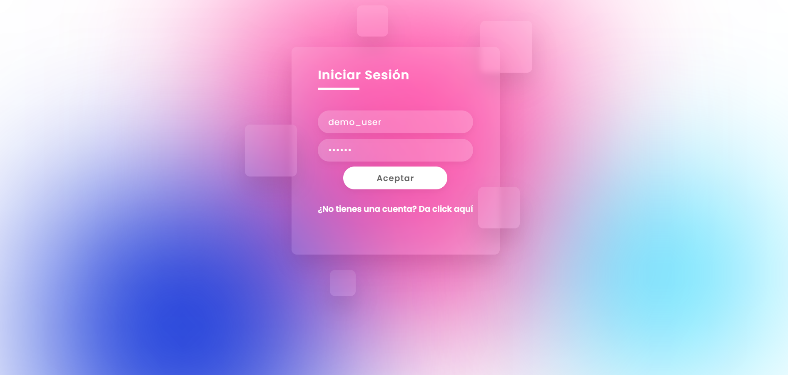
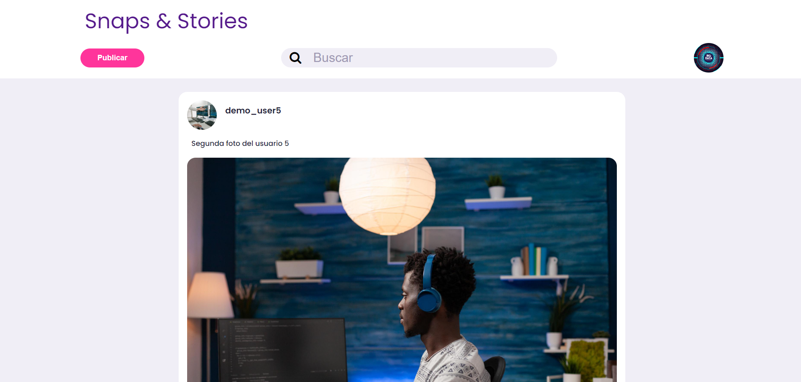
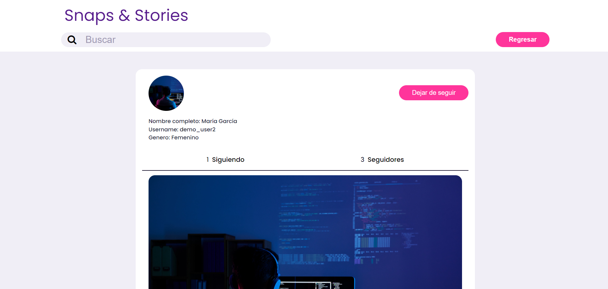
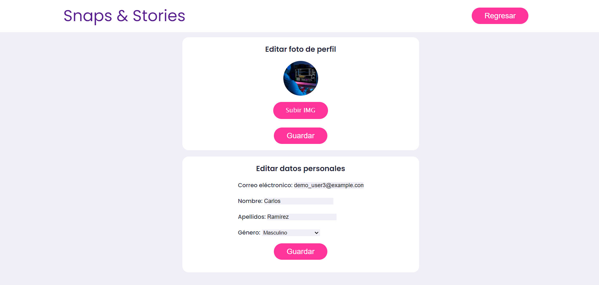

# Snaps & Stories

Este sistema fue desarrollado como parte de un proyecto universitario para la asignatura **"Programación web"**. El objetivo del proyecto fue Desarrollo de una aplicación web completa que incluya los elementos básicos de cualquier aplicación: registro de nuevos usuarios, control de autentificación (login), sesión de usuario, mostrar información en función del usuario y subir información. Esto para demostrar las competencias básicas que corresponden a la programación del lado del cliente (front-end) y del lado del servidor (back-end). Se trabajó en equipo, con un periodo de desarrollo de dos semanas.

## Descripción del Proyecto

Snaps & Stories es una red social diseñada para compartir fotos y conectar usuarios. Este proyecto fue desarrollado como parte de un trabajo universitario en equipo, con un enfoque en proporcionar una plataforma intuitiva y funcional para la interacción social en línea.

## Contribuciones del Equipo

Aunque el proyecto fue un esfuerzo colectivo, la mayor parte del desarrollo técnico, incluyendo la programación, la implementación de funcionalidades y el despliegue en Digital Ocean, fue realizada principalmente por mí. Mis compañeros del equipo contribuyeron en áreas específicas como el diseño UX/UI y la documentación.

### Roles del Equipo

- **Desarrollo Full-Stack:** Hernando Uriel Torres de Luna
  - Implementación de funcionalidades
  - Desarrollo del backend y frontend
  - Integración de base de datos y lógica de aplicación
  - Despliegue en Digital Ocean

- **Diseñador UX/UI:** Wiliam Hernán García Martínez
  - Diseño de wireframes y prototipos
  - Creación de interfaces de usuario intuitivas y atractivas

- **Documentadores y Conceptualización:** Leonel Octavio Ponce Rodrigues y Israel Guadalupe Gonzales Cortez
  - Elaboración de documentación técnica detallada
  - Desarrollo de la conceptualización y planificación del proyecto

## Tecnologías Utilizadas

- **Lenguajes de Programación:** PHP, HTML, CSS y JavaScript
- **Base de Datos:** MySQL
- **Herramientas de Desarrollo:** XAMPP y VS Code

## Instalación y Configuración

Para ejecutar este proyecto en tu entorno local, sigue estos pasos:

1. **Clona el Repositorio:**
   ```bash
   git clone https://github.com/urieltorres-dev/snaps-and-stories.git
   ```

2. **Configura el Entorno:**
   - Asegúrate de tener PHP y MySQL instalados en tu sistema.
   - Configura los parámetros de la base de datos en el archivo `helpers/config.php`.

3. **Importa la Base de Datos:**
   - Crea una base de datos llamada `snaps_and_stories`.
   - Ejecuta el archivo SQL proporcionado para crear las tablas y la vista.

4. **Ejecuta el Proyecto:**
   - Coloca los archivos del proyecto en el directorio de tu servidor web.
   - Accede a la aplicación a través de tu navegador web.

## Uso

Accede a la aplicación a través de [http://localhost/snaps-and-stories/](http://localhost/snaps-and-stories/).

## Capturas de Pantalla

A continuación se muestran algunas capturas de pantalla de la aplicación:






## Demo

Puedes ver una demostración en vivo del proyecto en [https://snaps-and-stories.zeabur.app/](https://snaps-and-stories.zeabur.app/).

## Licencia

Este proyecto está licenciado bajo la Licencia MIT - consulta el archivo [LICENSE](https://choosealicense.com/licenses/mit/) para más detalles.

## Contacto

Para más información, puedes contactarme a través de [urieltorres.dev@gmail.com](mailto:urieltorres.dev@gmail.com) o [github.com/urieltorres-dev](https://github.com/urieltorres-dev).

