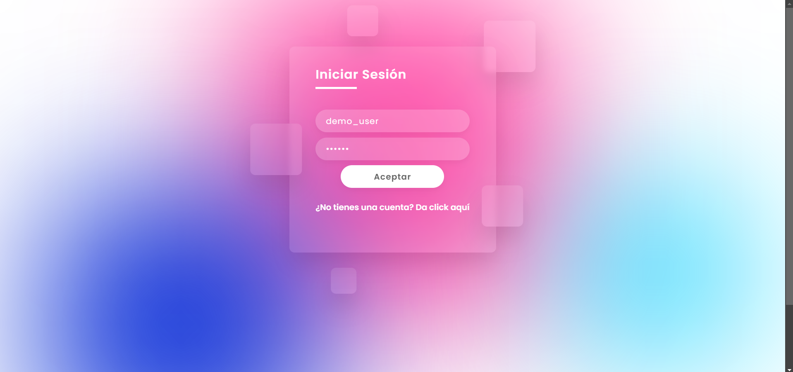
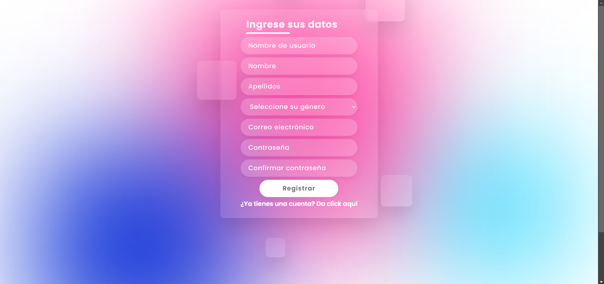
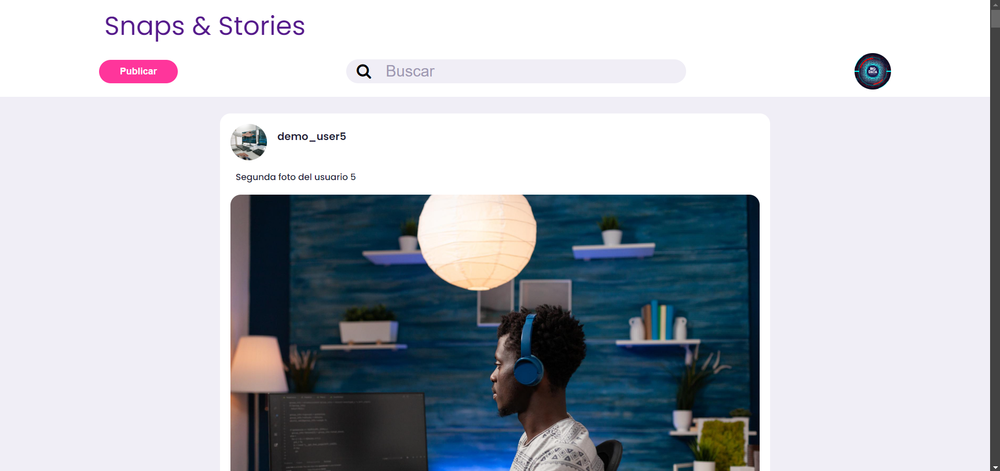
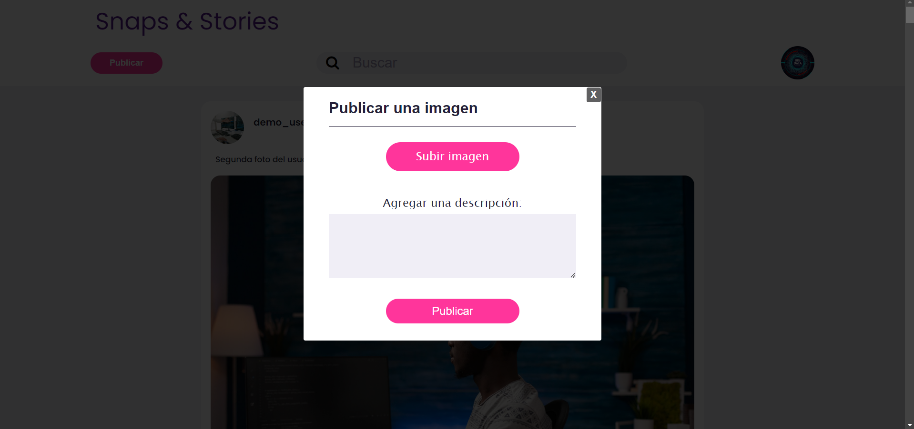
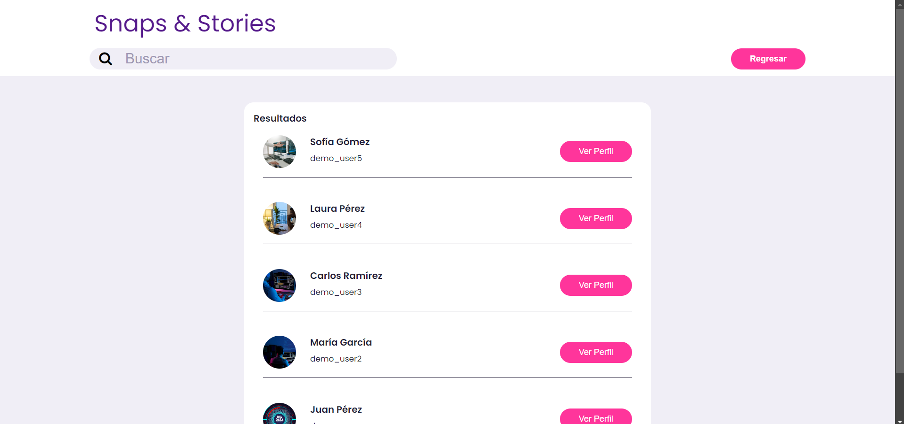
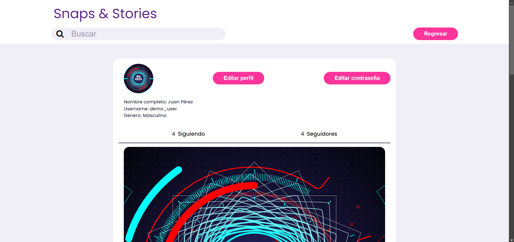
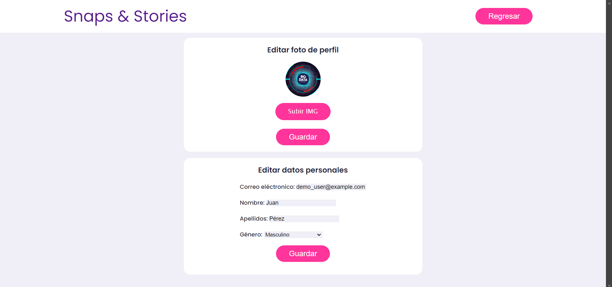
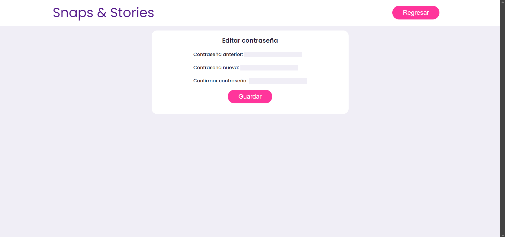

# Snaps & Stories

Este sistema fue desarrollado como parte de un proyecto universitario para la asignatura **"Programación web"**. El objetivo del proyecto fue Desarrollo de una aplicación web completa que incluya los elementos básicos de cualquier aplicación: registro de nuevos usuarios, control de autentificación (login), sesión de usuario, mostrar información en función del usuario y subir información. Esto para demostrar las competencias básicas que corresponden a la programación del lado del cliente (front-end) y del lado del servidor (back-end). Se trabajó en equipo, con un periodo de desarrollo de dos semanas.

## Descripción del Proyecto

Snaps & Stories es una red social diseñada para compartir fotos y conectar usuarios. Este proyecto fue desarrollado como parte de un trabajo universitario en equipo, con un enfoque en proporcionar una plataforma intuitiva y funcional para la interacción social en línea.

## Contribuciones del Equipo

Aunque el proyecto fue un esfuerzo colectivo, la mayor parte del desarrollo técnico, incluyendo la programación, la implementación de funcionalidades y el despliegue en Digital Ocean, fue realizada principalmente por mí. Mis compañeros del equipo contribuyeron en áreas específicas como el diseño UX/UI y la documentación.

## Tecnologías Utilizadas

- **Lenguajes:** PHP, HTML, CSS y JavaScript
- **Base de Datos:** MySQL
- **Herramientas de Desarrollo:** XAMPP y Visual Studio Code

## Instalación y Configuración

Para ejecutar este proyecto en tu entorno local, sigue estos pasos:

1. Clona el Repositorio:
```bash
git clone https://github.com/urieltorres-dev/snaps-and-stories.git
```

2. Configura el Entorno:
- Asegúrate de tener PHP y MySQL instalados en tu sistema.
- Configura los parámetros de la base de datos en el archivo `helpers/config.php`.

3. Importa la Base de Datos:
- Crea una base de datos llamada `snaps_and_stories`.
- Ejecuta el archivo SQL que se encuentra en `database/snaps_and_stories.sql` para crear las tablas y la vista.

4. Ejecuta el Proyecto:
- Coloca los archivos del proyecto en el directorio de tu servidor web.
- Accede a la aplicación a través de [http://localhost/snaps-and-stories/](http://localhost/snaps-and-stories/).

## Capturas de Pantalla

A continuación se muestran algunas capturas de pantalla de la aplicación:

<table>
  <tr>
    <td align="center">
      
      <br><b>Login</b>
    </td>
    <td align="center">
      
      <br><b>Register</b>
    </td>
  </tr>
  <tr>
    <td align="center">
      
      <br><b>Home / News Fee</b>
    </td>
    <td align="center">
      
      <br><b>Crear post</b>
    </td>
  </tr>
  <tr>
    <td align="center">
      
      <br><b>Buscar usuarios</b>
    </td>
    <td align="center">
      
      <br><b>Perfil de usuario</b>
    </td>
  </tr>
  <tr>
    <td align="center">
      
      <br><b>Editar perfil</b>
    </td>
    <td align="center">
      
      <br><b>Editar contraseña</b>
    </td>
  </tr>
</table>

## Demo

Por el momento la demo no está disponible.

## Licencia

Este proyecto está licenciado bajo la Licencia MIT - consulta el archivo [LICENSE](https://choosealicense.com/licenses/mit/) para más detalles.

## Contacto

Para más información, puedes contactarme a través de [urieltorres.dev@gmail.com](mailto:urieltorres.dev@gmail.com) o [github.com/urieltorres-dev](https://github.com/urieltorres-dev).

